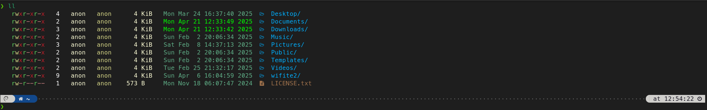
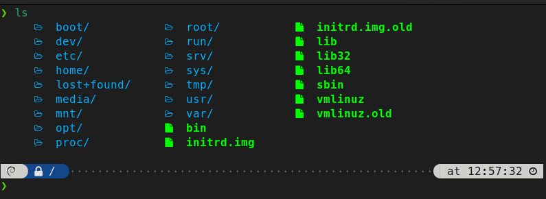

# Terminal Setup

My terminal customization setup for Debian 12, featuring Zsh, Oh My Zsh, Powerlevel10k, and colorls.

## Overview

This repository contains configuration files for a vibrant and productive Zsh terminal:

- **`.zshrc`**: Configures Zsh with Oh My Zsh, plugins (`git`, `zsh-autosuggestions`, `zsh-syntax-highlighting`), and `colorls` aliases.
- **`.p10k.zsh`**: Configures Powerlevel10k with a rainbow prompt style, using `nerdfont-v3`.

Inspired by *Customizing Your Terminal: Becoming a Zsh Power User*.

## Installation

1. **Install dependencies** (see `debian-terminal-setup.md` for detailed instructions):
   - Zsh, Oh My Zsh
   - Powerlevel10k
   - Meslo Nerd Font
   - colorls

2. **Copy configuration files**:
   ```bash
   cp .zshrc ~/.zshrc
   cp .p10k.zsh ~/.p10k.zsh
   ```

3. **Source Zsh configuration**:
   ```bash
   source ~/.zshrc
   ```

## Screenshots


Here are some screenshots showcasing the terminal setup:

### Powerlevel10k Prompt


### Enhanced Directory Listing with Colorls



## License

This project is licensed under the MIT License - see the [LICENSE](LICENSE) file for details.
